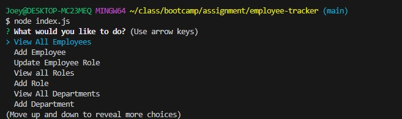

# employee-tracker

## Description

This program gives you the following options and allows you to pick through them

1. View all departments
2. View all roles
3. View all employees
4. Add a department 
5  Add a role
6. Add an employee
7. Update an employee role

If you add a department, role, or employee, it will live update and you'll be able to view the newly added department, role, or employee! For example, if you add a "Marketing" role, you can then add an employee, and when you decide what role to give the employee, the marketing role will exist as an option!

While doing this project, this project gave me a better understanding on how to write query options, as well as write code dynamically. Originally in the first version, everything was hard coded, so roles, departments, and employees would not update in certain functions. However, through trial and error, research, and help of classmates, I was able to get the dynamic function to work!

## Installation

You can install the employee-tracker application on github here

https://github.com/Rockojoe2/employee-tracker

You can view the video on how it functions here

https://drive.google.com/file/d/1-42kkAqxzYUnzRYEZH_d9ejkcbYMZ9ii/view

## Credits
UTA class folder

https://www.w3schools.com/MySQL/default.asp

https://dev.mysql.com/doc/connector-python/en/connector-python-api-cext-query.html#:~:text=query()%20Method,-Syntax%3A%20ccnx.&text=Executes%20an%20SQL%20statement.,buffered%20%2C%20raw%20%2C%20and%20raw_as_string%20.&text=buffered%20and%20raw%20%2C%20if%20not,values%20from%20the%20MySQL%20instance.

Worked with classmates May Pham (https://github.com/mayphamx), Lucas Wysoczanski (https://github.com/LucasWyski001) Daniel Lee: (https://github.com/drog41813) and Mica Villanueva(https://github.com/micavilla) 

## License

MIT License

---